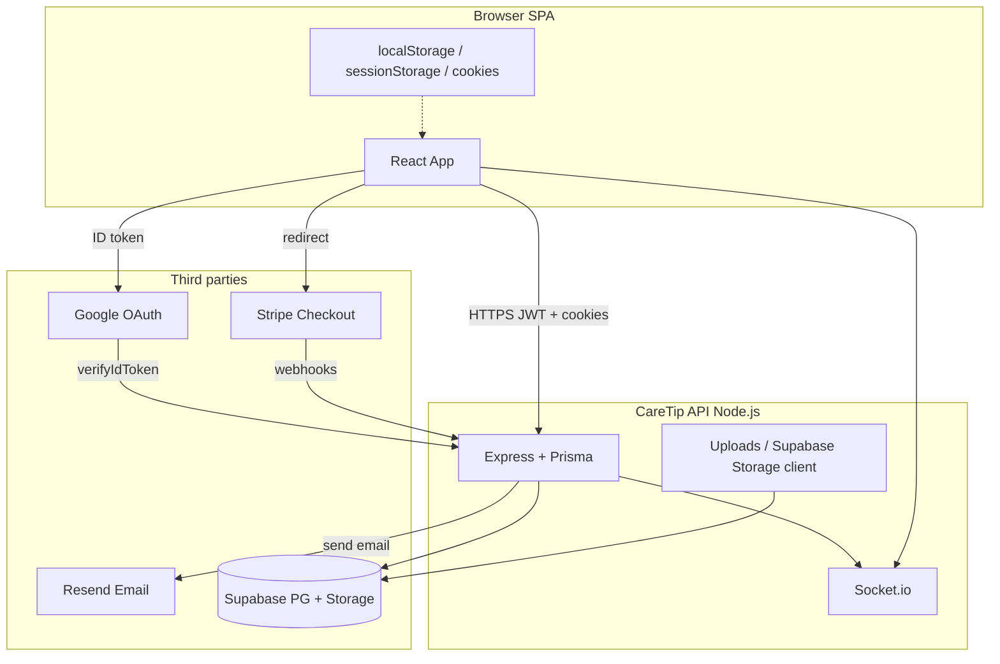

# GDPR / ROPA Technical Audit

**Product:** CareTip (digital tipping for hospitality)  
**Repository:** `caretip_project-main`  
**Audit type:** Technical inventory only (codebase analysis — no application logic changes)  
**Audit date:** 2026-05-22  
**Method:** Static review of frontend (`src/`), backend (`backend/`), root config, `package.json` / `package-lock.json`, `.env.example` files, Prisma schema, and README deployment notes.

> **Disclaimer:** This document describes what the codebase implements and configures. It is not legal advice. Contractual DPA/subprocessor lists, actual production env values, and cloud region selections must be confirmed by the data controller outside this repo.

---

## 1. Application Overview

| Aspect | Finding (evidence-based) |
|--------|---------------------------|
| **Architecture** | PERN stack: React 18 SPA (Vite), Express API (Node.js), PostgreSQL via Prisma, optional Socket.io for realtime events (`README.md`, `backend/src/index.ts`). |
| **Primary purposes** | Business/staff account management; QR tipping journeys; card payments via Stripe Checkout; dashboards and analytics; platform admin operations; transactional email. |
| **Personal data in scope** | Account identifiers (email, name), auth secrets (password hashes, OAuth subject), employee/business profile data, tip/transaction records, optional customer name/feedback on tips, IP/user-agent in login-alert emails, uploaded images (avatars/logos/KYC docs). |
| **Guest tipping** | No guest account required; optional `customerName` and feedback; repeat-tip state stored in browser `localStorage` (`README.md`, `src/app/lib/repeatTip.ts`). |
| **i18n** | UI language `en` / `de` via `i18next`; `caretip_i18n_language` in `localStorage` (`src/i18n/constants.ts`). |

**Key paths**

- Frontend entry: `index.html`, `src/main.tsx`, `src/app/routes.tsx`
- API entry: `backend/src/index.ts`
- Data model: `backend/prisma/schema.prisma`

---

## 2. Authentication & User Accounts

### 2.1 Mechanisms

| Component | Technology | Personal data | Code references |
|-----------|------------|---------------|-----------------|
| **Email/password registration & login** | `bcrypt` (cost factor 10), PostgreSQL `User` | Email, `passwordHash`, role, `emailVerified`, locale | `backend/src/services/auth.service.ts`, `backend/src/controllers/auth.controller.ts`, `backend/src/routes/auth.routes.ts` |
| **Access tokens** | JWT (`jsonwebtoken`), `Authorization: Bearer` | `userId`, email, role, optional `impersonatedBy` | `backend/src/middleware/auth.middleware.ts`, `backend/src/services/auth.service.ts` |
| **Refresh sessions** | HttpOnly cookie `caretip_refresh`, SHA-256 hash in `refresh_tokens` | Opaque refresh token (hashed at rest); rotation on use | `backend/src/services/refreshToken.service.ts`, `src/app/lib/api.ts` (`credentials: "include"` on refresh) |
| **Google Sign-In** | `@react-oauth/google` (SPA) + `google-auth-library` `verifyIdToken` (API) | Email, Google `sub`, name; stored as `oauthProvider` / `oauthSubject` | `src/app/App.tsx`, `src/app/components/AuthOAuthButtons.tsx`, `backend/src/services/oauthAuth.service.ts` |
| **Email verification** | One-time tokens (SHA-256 hash in DB), links to SPA | Email, raw token in URL (email only) | `backend/src/services/emailVerification.service.ts`, `EmailVerificationToken` model |
| **Password reset** | One-time tokens (SHA-256), Resend email | Email | `backend/src/services/passwordReset.service.ts` |
| **Employee activation** | Activation tokens + email | Email, employee id | `backend/src/services/employeeActivation.service.ts`, `employeeActivationEmail.service.ts` |
| **2FA (TOTP)** | `speakeasy` — optional per user | TOTP secret fields on `User` | `backend/src/controllers/auth.controller.ts` (`/2fa/*`) |
| **Platform impersonation** | Short-lived JWT with `impersonatedBy` | Admin id, manager session | `backend/src/services/platform.service.ts`, `backend/src/routes/platform.routes.ts` |
| **RBAC** | Prisma `Role`: `EMPLOYEE`, `MANAGER`, `SUPER_ADMIN` | Role claims in JWT; DB re-check for platform admin | `auth.middleware.ts`, `requireRole`, `requirePlatformAdmin` patterns |
| **Brute-force mitigation** | `express-rate-limit` on login, forgot/reset password | IP (rate limit key) | `backend/src/middleware/rateLimit.middleware.ts` |
| **Email send rate limit** | In-memory per-email bucket (1h window) | Email address | `backend/src/utils/emailRateLimit.ts` |

### 2.2 Client-side session storage

| Storage key / mechanism | Data | Purpose | Files |
|-------------------------|------|---------|-------|
| `caretip_token` | JWT access token | API auth | `src/app/lib/api.ts`, `authUserStore.ts` |
| `caretip_user` | Serialized user profile | UI session bootstrap | `src/app/lib/authUserStore.ts` |
| `caretip_session_revoked` | Timestamp | Block silent refresh after logout | `src/app/lib/api.ts` |
| `caretip_refresh` cookie | Refresh token | Server-set HttpOnly (not readable by JS) | `refreshToken.service.ts` |
| `caretip_i18n_language` | `en` \| `de` | Language preference | `src/i18n/constants.ts` |
| `caretip-theme` | `light` \| `dark` | Theme (`index.html` inline script, `ThemeContext.tsx`) | |
| `sidebar` cookie | Open/closed state | UI (`sidebar.tsx`) | `src/app/components/ui/sidebar.tsx` |
| `caretip_auth_debug` | Flag | Dev logging when `=1` | `src/app/lib/authDebugLog.ts` |

**Cookie attributes (refresh):** `httpOnly: true`, `secure: true` in production, `sameSite: "none"` (prod) / `"lax"` (dev) — `backend/src/services/refreshToken.service.ts`.

### 2.3 Third-party authentication processor

| Processor | Role | Region |
|-----------|------|--------|
| **Google OAuth / Google Identity Services** | ID token issuance & verification | **Not verifiable from current codebase** (Google infrastructure; client ID configured via env). |

**Env vars:** `GOOGLE_CLIENT_ID`, `VITE_GOOGLE_CLIENT_ID`, `NEXT_PUBLIC_GOOGLE_CLIENT_ID` (`.env.example`, `src/app/lib/googleOAuthWebClientId.ts`).

---

## 3. Payments & Financial Data

| Component | Technology | Personal / financial data | Code references |
|-----------|------------|---------------------------|-----------------|
| **Stripe Checkout** | `stripe` npm SDK — Checkout Sessions, PaymentIntents | Card data processed on **Stripe-hosted** pages (not stored in CareTip DB per UI copy); metadata may include `employeeId`, `businessId`, `locationId`, `tableId`, amounts, optional `customerName`, truncated `feedback` | `backend/src/services/stripe.service.ts`, `backend/src/controllers/payment.controller.ts`, `backend/src/webhooks/stripe.webhook.ts`, `src/app/pages/customer/PaymentPage.tsx` |
| **Webhook** | Raw body + `STRIPE_WEBHOOK_SECRET` signature verification | Payment events, PI/session ids | `backend/src/index.ts` (`/api/webhook`, `/api/webhooks`) |
| **Transactions** | PostgreSQL `tips` / `Transaction` model | Amount, status, Stripe PI id, employee/business/location/table FKs | `schema.prisma` |
| **Tip feedback** | `tip_feedback` table | Optional rating, comment, tags, `customerName`, Stripe session id | `feedback.controller.ts`, `TipFeedback` model |
| **Business Stripe Connect field** | `Business.stripeAccountId` optional column | Stripe account id (Connect-style field present; full Connect flow **not fully enumerated in this audit**) | `schema.prisma` |
| **Platform health** | Stripe API ping | None directly | `platform.service.ts` `checkStripeHealth` |

**Env vars:** `STRIPE_SECRET_KEY`, `STRIPE_WEBHOOK_SECRET`, `STRIPE_PUBLISHABLE_KEY` (optional), `FRONTEND_URL` for redirect URLs (`backend/.env.example`).

**Frontend:** No Stripe.js Payment Element found in customer flow — redirect to Stripe Checkout URL returned by API.

**PCI note (technical):** Application copy states card numbers are not stored (`en.json` `tipFlow.payment.stripeCardNote`); payment card processing is delegated to Stripe Checkout.

---

## 4. Analytics & Tracking

### 4.1 Product / operational analytics (first-party)

| Feature | Data | Notes |
|---------|------|-------|
| **Business & employee dashboards** | Aggregated tip stats, time ranges, business timezone | Computed from PostgreSQL; no third-party analytics SDK detected in `src/` dependencies. |
| **Platform admin analytics** | Global transaction/stats rollups | `platformAnalytics.service.ts`, `AdminDashboard.tsx` |
| **Audit logs** | `action`, `userId`, optional `metadata` text | `AuditLog` model, `audit.service.ts`, `audit.middleware.ts` |

### 4.2 Third-party marketing / product analytics

| Tool | Detected in codebase? |
|------|---------------------|
| Google Analytics / GTM | **No** application integration found |
| Meta Pixel / ads | **No** |
| Hotjar / Mixpanel / PostHog / Amplitude / Segment | **No** |
| Sentry / Datadog / LogRocket | **No** dedicated SDK |

### 4.3 Incidental / infrastructure-related

| Item | Notes |
|------|-------|
| **Workbox `workbox-google-analytics`** | Present as **transitive** dependency in `package-lock.json` via `vite-plugin-pwa`; **not configured** in `vite.config.ts` runtime caching (no GA network rules enabled). |
| **PWA service worker** | Precaches JS/CSS/HTML/fonts; runtime cache rule for `fonts.googleapis.com` / `gstatic.com` exists in `vite.config.ts` but **primary fonts are self-hosted** (`index.html`, `public/fonts/`, `@fontsource/*`). |
| **Console logging** | `logClientError` → `console.error` only (`src/app/lib/clientLog.ts`); server `logServerError` patterns in backend. |

---

## 5. Notifications & Communication

| Channel | Provider | Purpose | Personal data | Implementation |
|---------|----------|---------|---------------|----------------|
| **Transactional email** | **Resend** (`https://api.resend.com/emails`) | Verification, welcome, password reset, employee activation, optional new-login alert | Email, locale, links with raw tokens; login alert may include **IP**, **User-Agent** | `backend/src/services/resendClient.ts`, email services under `backend/src/services/*Email*.ts`, `localizedNotificationEmail.service.ts` |
| **In-app realtime** | **Socket.io** (self-hosted on API origin) | New tip events to connected clients | JWT in handshake auth; public rooms by `businessId` / slug without token | `backend/src/socket/socketServer.ts`, `src/app/hooks/useSocket.ts` |
| **Email preference flags** | PostgreSQL `user_settings`, `Employee` | Tip/summary/system/login alerts toggles | Email notification prefs stored as booleans | `UserSettings`, `employee.service.ts`, `settings.controller.ts` |
| **Push notifications (mobile/web push)** | — | `Employee.pushNotifications` and settings UI exist | **No** Web Push API, FCM, APNs, or OneSignal integration found in codebase — flag appears **preference-only** until a provider is wired. |
| **SMS** | — | **Not found** | — | — |

**Resend default from address in code:** `CareTip <no-reply@mail.caretip.com>` (`resendClient.ts`) — production sender must match verified Resend domain.

**Env:** `RESEND_API_KEY`, `RESEND_FROM` / `RESEND_FROM_EMAIL`, `FRONTEND_URL`.

---

## 6. File Storage & Databases

### 6.1 Database

| System | Usage | Personal data categories | Region |
|--------|-------|------------------------|--------|
| **PostgreSQL** (via **Prisma**) | System of record | Users, businesses, employees, tips, feedback, tokens (hashed), audit logs, goals, locations/tables, settings | **Not verifiable from current codebase** — `.env.example` shows Supabase pooler hostname pattern `aws-0-REGION.pooler.supabase.com` (placeholder `REGION`). |

**Connection:** `DATABASE_URL` only; pooler documented in `backend/prisma/schema.prisma`, `databaseUrl.ts`.

### 6.2 Object / file storage

| Backend | When used | Data | Public access |
|---------|-----------|------|---------------|
| **Supabase Storage** | If `SUPABASE_URL` + `SUPABASE_SERVICE_ROLE_KEY` set | Employee avatars, business logos, verification documents | Public bucket URLs (documented in `.env.example`) |
| **Local disk `./uploads`** | Fallback / dev | Same image types | Served via Express static `/uploads` + `PUBLIC_API_BASE_URL` |

**Implementation:** `backend/src/lib/supabaseStorageClient.ts`, `backend/src/services/upload.service.ts`, `imageUploadValidation.ts` (max 5 MB, MIME sniffing).

**Client upload validation:** `src/app/lib/imageClientUpload.ts`.

### 6.3 Exports

| Feature | Technology | Data |
|---------|------------|------|
| **Transaction CSV export** | `json2csv` | Tip/transaction fields per business export route | `backend/src/controllers/transactions.controller.ts` |

### 6.4 CDN / external media (non-storage processors)

| Resource | Used in | Notes |
|----------|---------|-------|
| **Stripe-hosted checkout** | Payment flow | External redirect |
| **Spline** (`prod.spline.design`) | Optional demo/components | `src/imports/pasted_text/spline-scene-demo.tsx`, lazy `@splinetool/react-spline` — **not required for core tipping** |
| **Google Cloud Storage sample video** | `TestimonialsSection.tsx` | `commondatastorage.googleapis.com` — legacy/marketing component |

---

## 7. Hosting & Infrastructure

Deployment is **environment-driven**; the repo documents split hosting but does not pin a single production vendor.

| Layer | Evidence in codebase | Typical env vars |
|-------|----------------------|------------------|
| **Frontend static hosting** | `vercel.json` (SPA rewrites, Vite build); README mentions Vercel/Netlify | `BASE_URL`, `VITE_API_URL`, `VITE_*` |
| **API hosting** | `resolvePublicApiBaseUrl()` checks `RENDER_EXTERNAL_URL`, `RAILWAY_PUBLIC_DOMAIN`, `FLY_APP_NAME`, `HEROKU_APP_NAME`, `VERCEL_URL` | `PORT`, `PUBLIC_API_BASE_URL`, `FRONTEND_URL` |
| **Database** | Supabase PostgreSQL pooler URLs in examples | `DATABASE_URL` |
| **File storage** | Supabase Storage when configured | `SUPABASE_*` |
| **Email** | Resend SaaS | `RESEND_*` |
| **Payments** | Stripe SaaS | `STRIPE_*` |

**CDN:** No Cloudflare/Fastly SDK in app; any CDN in front of Vercel/Render is **not verifiable from current codebase**.

**TLS:** HTTPS assumed for production API/public URLs; local dev uses `http://localhost`. Stripe/Resend/Google use HTTPS APIs.

**Region:** Production AWS/Supabase region is **not verifiable from current codebase** (only placeholder in `backend/.env.example`).

---

## 8. Security Measures

| Measure | Implementation | Evidence |
|---------|----------------|----------|
| **HTTPS / TLS** | Expected for production frontends and API base URLs; Stripe/Resend/Google API calls over TLS | Env examples, `resolvePublicApiBaseUrl` |
| **Password hashing** | `bcrypt` with rounds `10` | `auth.service.ts`, `passwordReset.service.ts` |
| **JWT access tokens** | Signed with `JWT_SECRET`; default expiry ~15m (`JWT_EXPIRES_IN`) | `auth.middleware.ts`, `auth.service.ts` |
| **Refresh token security** | Random 48-byte token; SHA-256 stored; rotation; HttpOnly cookie | `refreshToken.service.ts` |
| **One-time tokens** | SHA-256 of secret in DB; raw token only in email URL | README, reset/verification services |
| **Stripe webhook integrity** | Signature verification on raw body | `stripe.service.ts` `verifyWebhookSignature` |
| **CORS** | `cors({ origin: true, credentials: true })` — reflects request origin | `backend/src/index.ts` |
| **Rate limiting** | Login, forgot password, reset password | `rateLimit.middleware.ts` |
| **Trust proxy** | `app.set("trust proxy", 1)` in production | `index.ts` (for correct IP behind reverse proxy) |
| **Platform admin** | DB-backed `SUPER_ADMIN` + `isPlatformAdmin` + `isActive` | README, platform routes |
| **Audit logging** | Append-only `audit_logs` for sensitive platform actions | `audit.service.ts` |
| **Image upload validation** | Size cap, MIME allowlist, magic-byte sniffing | `imageUploadValidation.ts` |
| **CSRF** | No explicit CSRF token middleware found; refresh cookie uses `SameSite`; API uses Bearer JWT for mutations | **Partial / pattern-based** — confirm for cookie-only endpoints |
| **Security headers (Helmet, CSP)** | **Not found** in Express setup | `backend/src/index.ts` |
| **Secrets in client bundle** | Only `VITE_*` / `NEXT_PUBLIC_*` intended for browser; `SUPABASE_SERVICE_ROLE_KEY` server-only | `.env.example` warnings |
| **JSON body size** | Raw body capture limited to 4KB for logging helper on `express.json` | `index.ts` |
| **Account deletion** | Employee `DELETE /api/employees/me` | `employee.routes.ts`, `deleteMyAccount` |
| **Business deletion** | Cascading delete logic for venue + staff users | `business.service.ts` |

---

## 9. Third-Party Processors / Subprocessors

Processors inferred from **dependencies and API calls** (confirm DPAs in operations).

| Processor | Category | Likely processing | Hosting region |
|-----------|----------|-------------------|----------------|
| **Supabase** | Database (+ optional Storage) | PostgreSQL hosting; object storage for images | **Not verifiable from current codebase** (project-specific) |
| **Stripe** | Payments | Checkout, PaymentIntents, webhooks; possible Connect account ids | **Not verifiable from current codebase** (Stripe account settings) |
| **Resend** | Email | Transactional email delivery | **Not verifiable from current codebase** |
| **Google** | Authentication | OAuth ID tokens (GSI) | **Not verifiable from current codebase** |
| **Vercel** (if used) | Frontend hosting | Static asset hosting, env injection at build | **Not verifiable from current codebase** |
| **Render / Railway / Fly.io / Heroku** (if used) | API hosting | Node.js API runtime | **Not verifiable from current codebase** |
| **Spline** (optional) | 3D asset CDN | Scene loading if demo routes used | **Not verifiable from current codebase** |

**Not detected as processors:** Firebase, AWS SDK (direct), Azure, Twilio/SMS, SendGrid (except Resend pattern), Mailchimp, Intercom, Cloudflare (as integrated service).

---

## 10. Potential GDPR-Relevant Data Flows

| Flow | Data subjects | Data categories | Legal basis (operational — **not legal conclusion**) |
|------|---------------|-----------------|------------------------------------------------------|
| **Sign-up / login** | Managers, employees, admins | Identity, credentials, role | Contract / account management |
| **Google OAuth** | Same | Identity from Google | Contract / consent to link account |
| **Guest tip via QR** | Guests (non-registered) | Payment amount, optional name/feedback; Stripe payment data | Contract / legitimate interest (tip execution) |
| **Repeat tip (local)** | Returning guests | Last employee id, amount, session id in `localStorage` | **Browser-only** — no server storage of repeat-tip key documented |
| **Dashboards** | Staff, managers | Work performance (tips), profile | Contract |
| **Platform admin** | Operators | Access to global transactions, impersonation, audit | Legitimate interest / legal obligation (internal ops) |
| **Emails** | Users | Email address, tokens in links, login metadata | Contract / security |
| **File uploads** | Staff, businesses | Photos, logos, KYC documents | Contract / legal obligation (verification) |
| **CSV export** | Authenticated business users | Transaction records | Contract / portability feature |
| **Realtime tips** | Staff/managers (connected clients) | Tip event metadata via sockets | Contract |

---

## 11. Missing / Unclear Areas Requiring Confirmation

| Topic | Status |
|-------|--------|
| **Actual production host regions** (Supabase, Vercel, API host) | **Not verifiable from current codebase** |
| **Whether Stripe Connect payouts are live** | `stripeAccountId` column exists; full payout flow not traced in this audit |
| **DPA / subprocessor register** | Not in repository |
| **Data retention / deletion schedules** | Partial (account delete endpoints); no global retention policy in code |
| **Legal basis & privacy policy alignment** | Marketing/legal pages exist (`CookiesPage`, static copy) — not mapped to technical controls here |
| **Push notification provider** | UI/DB flags only — **no push delivery integration** |
| **`sendLocalizedUserNotificationEmail`** | Implemented but **no callers found** — dead code path or future use |
| **Production CORS policy** | `origin: true` allows any origin with credentials — confirm hardening in production |
| **Helmet / CSP / HSTS** | Not implemented in Express |
| **Backup & disaster recovery** | Provider-side (Supabase/host) — **not verifiable from current codebase** |
| **Subprocessors of Stripe/Google/Resend** | Standard subprocessors — confirm via vendor DPAs |
| **AI / LLM data sharing** | **No** OpenAI or similar integration in dependencies |
| **Playwright / dev-only tools** | E2E tests — not production processing |

---

## 12. Suggested ROPA Entries

Use as a starting point for Records of Processing Activities (Article 30 GDPR). Adjust legal basis, retention, and controller/processor roles with legal counsel.

| Processing activity | Purpose | Data categories | Data subjects | Recipients / processors | Transfers | Security measures (summary) |
|--------------------|---------|-----------------|---------------|-------------------------|-----------|------------------------------|
| User registration & authentication | Provide accounts | Email, name, password hash, OAuth ids, role, locale, 2FA secret | Managers, employees, platform admins | Google (OAuth), internal API | OAuth may involve US — confirm Google SCCs | bcrypt, JWT, HttpOnly refresh, rate limits |
| Email verification & password recovery | Security & account integrity | Email, hashed tokens | Users | Resend | **Confirm** Resend region/DPA | Hashed tokens; HTTPS links |
| Employee invitation & activation | Onboard staff | Email, name, activation tokens | Employees | Resend | **Confirm** | Time-limited tokens |
| Guest card tipping | Collect tips | Amount, optional name/feedback; card data at Stripe | Guests, employees (beneficiaries) | Stripe | **Confirm** Stripe international transfers | Stripe Checkout; webhook verification |
| Tip & transaction storage | Reporting, payouts prep | Financial amounts, IDs, timestamps, Stripe references | Employees, businesses | Supabase (DB) | **Confirm** region | Access control via RBAC |
| Business verification | Trust & compliance | Business legal/contact data, tax id, verification docs | Managers | Supabase Storage (if used) | **Confirm** | Server-side upload validation |
| Profile images | Identity in app | Photos | Employees, businesses | Supabase Storage or disk | **Confirm** | Size/type validation |
| Realtime tip notifications | UX for staff | Tip event payloads | Employees, managers | Self (Socket.io) | Usually none | JWT/socket auth |
| Dashboard analytics | Business intelligence | Aggregated tips (no third-party analytics SDK) | Managers, employees | Internal only | — | Auth required |
| Platform administration | Operate service | Global transaction data, audit logs, impersonation | Admins, all users (accessed) | Internal | — | SUPER_ADMIN checks, audit logs |
| Login alert emails | Security awareness | Email, IP, user-agent | Users (opt-in setting) | Resend | **Confirm** | `notify_new_login` preference |
| CSV export | Portability / reconciliation | Transaction rows | Managers | None (download to user device) | — | Authenticated export |
| Account deletion | Erasure request support | User/employee records | Employees (endpoint present) | Internal DB | — | Delete handlers |
| PWA / local browser storage | UX, repeat tips, theme, language | Preferences, tip session id, tokens | All browser users | None (device-local) | — | User can clear storage |
| Cookie (refresh + UI)** | Session / UI state | Session token, sidebar state | Logged-in users | First-party | — | HttpOnly + SameSite on refresh |

---

## Summary Table

| Service / component | Purpose | Personal data | Hosting region | GDPR relevance |
|---------------------|---------|---------------|----------------|----------------|
| **PostgreSQL (Supabase)** | Primary database | Accounts, profiles, tips, feedback, tokens (hashed), audit | **Not verifiable from current codebase** | Core storage; Art. 30 ROPA, Art. 32 security, DPA with Supabase |
| **Supabase Storage** | Avatars, logos, KYC files | Images, document paths/URLs | **Not verifiable from current codebase** | Processor if enabled; public bucket URLs |
| **Stripe** | Card payments & webhooks | Payment metadata, PI/session ids; card data at Stripe | **Not verifiable from current codebase** | Processor; PCI delegation; tip processing |
| **Resend** | Transactional email | Email, names in body, tokens in links, IP/UA (login alert) | **Not verifiable from current codebase** | Processor; Art. 6/13 transparency for emails |
| **Google OAuth** | Social login | Email, Google subject, display name | **Not verifiable from current codebase** | Processor; identity verification |
| **Socket.io (self-hosted)** | Live tip events | User/business ids in events | Same region as API host | **Not verifiable from current codebase** | Limited personal data; security of auth handshake |
| **Express API (CareTip)** | Application logic | All server-side processing | Deploy-target dependent | Controller/processor role depends on deployment |
| **Vite/React SPA** | User interface | Client-side storage of token, profile, preferences | User device + static host | Transparency, cookies/local storage |
| **localStorage / sessionStorage** | Session, i18n, repeat tip, theme | Token, user JSON, tip history, prefs | User device (EU/EEA unknown) | ePrivacy / storage info |
| **HttpOnly refresh cookie** | Session continuity | Opaque refresh token | User device | Security measure; cookie policy |
| **bcrypt / JWT / speakeasy** | Crypto libraries (no cloud) | Secrets at rest/in transit | On-controller infrastructure | Security (Art. 32) — not subprocessors |
| **Prisma** | ORM (library) | — | — | Not a processor |
| **@react-oauth/google** | Load Google GSI script | Triggers call to Google when used | Google CDN | Third-party script disclosure |
| **Spline (optional)** | 3D demos | IP/usage to Spline if loaded | **Not verifiable from current codebase** | Only if routes enabled |
| **Workbox PWA** | Offline caching | Cached static assets locally | User device | Low risk; no analytics enabled in config |
| **Playwright** | Dev/E2E tests only | Test credentials if used in CI | CI environment | Not production processing |

---

## Appendix A — Environment variables (inventory)

**Backend (`backend/.env.example`, root `.env.example`):**

`DATABASE_URL`, `JWT_SECRET`, `JWT_EXPIRES_IN`, `REFRESH_TOKEN_EXPIRES_DAYS`, `ADMIN_SEED_SECRET`, `STRIPE_SECRET_KEY`, `STRIPE_WEBHOOK_SECRET`, `STRIPE_PUBLISHABLE_KEY`, `FRONTEND_URL`, `RESEND_API_KEY`, `RESEND_FROM`, `GOOGLE_CLIENT_ID`, `SUPABASE_URL`, `SUPABASE_SERVICE_ROLE_KEY`, `SUPABASE_STORAGE_BUCKET`, `PUBLIC_API_BASE_URL`, `PORT`, `AUTH_LOGIN_MAX_PER_WINDOW`, `AUTH_DEBUG_LOGIN`, `EMAIL_VERIFICATION_BYPASS_*`, `ALLOW_ADMIN_SEED_IN_PRODUCTION`, `RENDER` (warn path), etc.

**Frontend (Vite):**

`VITE_API_URL`, `BASE_URL` / `VITE_BASE_URL` / `NEXT_PUBLIC_*`, `VITE_GOOGLE_CLIENT_ID`, `VITE_CARETIP_APP_ORIGIN` (injected at build), optional `VITE_STRIPE_PUBLISHABLE_KEY` (mentioned in backend example), `VITE_APP_VERSION`, `VITE_LIVE_IN_MINUTES_DEMO_VIDEO` (landing demo).

---

## Appendix B — NPM packages with off-device network potential

| Package | Network endpoint (typical) |
|---------|---------------------------|
| `stripe` | `api.stripe.com` |
| `@supabase/supabase-js` | `*.supabase.co` |
| `google-auth-library` / Google APIs | `oauth2.googleapis.com` |
| `@react-oauth/google` | Google Identity Services (browser) |
| `socket.io-client` | Configured API origin |
| Resend via `fetch` | `api.resend.com` |

**Frontend dependencies without mandatory third-party telemetry:** React, Radix, MUI, Framer Motion, i18next, Recharts, etc. — libraries only; no vendor analytics identified.

---

*End of technical audit.*
